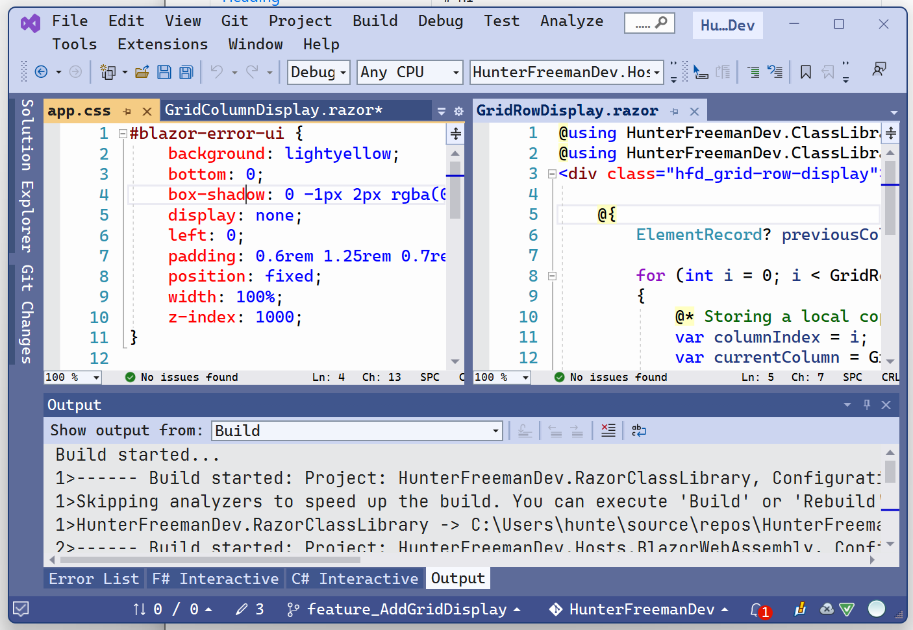

# Goal
Add the Grid system that exists in most IDEs and Editors.

### Here is a photo of Visual Studio's grid system when the user is not dragging a window and without any annotation by myself.

Note in the image the following aspects:
- There appears to be a "window" like object in Visual Studio. For example: "GridRowDisplay.razor" is the name of a tab on one of the "window" like objects"
- There can be many "tabs" on the "window" like object as shown in the "window" that displays the file named "app.css". It has two tabs: "app.css", "GridColumnDisplay.razor"
- Sidebar panels that can be opened or pinned. See for example on the far left of the image there are the two panels titled: "Solution Explorer", "Git Changes"
- There can be many "window"s in a row. As well, there can be many rows; each row can contain many "window"s.
- There is a Toolbar at the top of the image. This is unrelated to the GridDisplay Blazor component in the immediate sense. However, one should take note that the Grid is not to take 100% of the viewport both width, or height. Althought, side node: maybe the Grid display has "static" rows which would act as the toolbar. These "static" rows might be unchangeable to provide the "Toolbar" at a later point in time.

Those are the main aspects in the Visual Studio Grid System I want to call attention to for now.