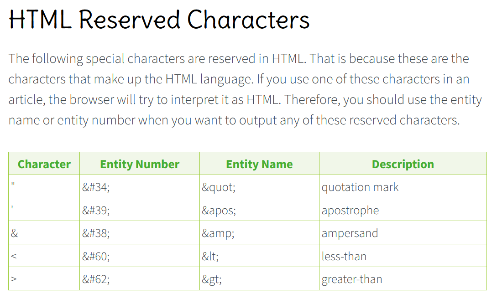

# Goal
Add a PlainTextEditor similar to the Windows operating system program named "Notepad"

- [X] Listen for OnKeyDownEvents
- [X] Track the currently focused section of the website.
    - [X] For example, track the currently focused PlainTextEditor
        - [X] Only the currently focused PlainTextEditor is to respond to the OnKeyDownEvents.
- [ ] PlainTextEditor is to behind the scenes handle OnKeyDownEvents by altering the "document" in immutable ways that are undo-able and redo-able.
- [ ] PlainTextEditor is to be a List<List<TextSyntaxRecord>> where "TextSyntaxRecord can be named as it best fits.
- [ ] Handle the following TextSyntaxTokens:
    - [ ] PlainTextSyntaxToken
    - [ ] WhitespaceTextSyntaxToken
- [ ] What You See Is What You Get ([WYSIWYG](https://en.wikipedia.org/wiki/WYSIWYG))
    - [ ]Properly Escape [HTML Reserved Characters](https://www.html.am/reference/html-special-characters.cfm)  when rendering text. 
- [ ] Do not write out the keypresses for non Alphanumerics as the key itself.
    - [ ] For example:
        - [ ] (F Keys) Example: when the F10 key is pressed do not write out "F10".
        - [ ] (Meta Keys) Example: when the Backspace key is pressed do not write out "Backspace".
        - [ ] (Whitespace Keys) Example: when the Space key is pressed do not write out "Space".
        - [ ] (Modifier Keys / Layer Keys) Example: when the Shift key is pressed do not write out "Shift".  
- [ ] Ensure the PlainTextEditor works on mobile devices (phones, tablets, etc)
- [ ] Ensure undo and redo functionality works for:
    - [ ] Undo Document Edit Stack
    - [ ] Redo Document Edit Stack
    - [ ] Undo Jump Movement Stack
    - [ ] Redo Jump Movement Stack
- [ ] Handle the folllowing special keybinds
    - [ ] Ctrl + A
        - [ ] Function: Select the entirety of the active PlainTextEditor document.
    - [ ] Ctrl + S
        - [ ] Function 1: Save the changes to the active PlainTextEditor document.
        - [ ] Function 2: If the PlainTextEditor document is not yet written to the operating system file system perform a "Save As" operation meaning ask the user where to place the file then save the initial copy.
    - [ ] Ctrl + C
        - [ ] Function: Copy the current selection to the operating system clipboard.
    - [ ] Ctrl + V
        - [ ] Function: Paste the current operating system clipboard contents into the PlainTextEditor document at the current index position within the document.
    - [ ] Ctrl + X
        - [ ] Function: Cut the current selection (copy the current text, delete the current text)
    - [ ] Ctrl + Z
        - [ ] Function: Undo the most recent Document Edit.
    - [ ] Ctrl + Y
        - [ ] Function 1: Redo the most recent Document Undo.
        - [ ] Function 2: Clear the "most recent document undo" so the user cannot "redo" in the case that the user "undo's" a document edit then proceeds to make a document edit as new "history" is being made.